# 🔧 16-bit RISC Processor Design Using VHDL

A comprehensive implementation of a 16-bit RISC (Reduced Instruction Set Computing) processor designed and developed using VHDL (VHSIC Hardware Description Language). This project demonstrates fundamental processor architecture concepts, instruction set design, and hardware description language implementation.

## 🎯 Project Overview

This project was developed as part of the Programmable Logic Circuits and VHDL Programming module in the 7th semester of the Robotics and Cobotics Engineering program. It implements a complete 16-bit RISC processor with a custom instruction set architecture (ISA), designed for educational purposes and practical understanding of processor design principles.

### Key Features

- **16-bit RISC Architecture**: Simplified instruction set for efficient execution
- **Custom ISA**: Comprehensive instruction set including arithmetic, logic, control, and memory operations
- **Modular Design**: Component-based architecture for easy testing and maintenance
- **VHDL Implementation**: Complete hardware description using industry-standard VHDL
- **Simulation Validated**: Thoroughly tested using ModelSim simulation environment
- **Educational Focus**: Designed to demonstrate fundamental processor concepts

## 🎓 Academic Context

- **Module**: Programmable Logic Circuits and VHDL Programming
- **Supervisor**: Pr. AMMOUR Alae
- **Semester**: 7
- **Program**: Robotics & Cobotics Engineering
- **Institution**: Euro-Mediterranean University of Fez (EuroMed)
- **School**: Digital Engineering and Artificial Intelligence (EIDIA)
- **Academic Year**: 2024-2025

## 🏗️ Processor Architecture

### System Overview

The processor follows a modular RISC architecture with the following main components:

| Component | Function | Description |
|-----------|----------|-------------|
| **CPU** | Central Processing Unit | Main control unit coordinating all operations |
| **ALU** | Arithmetic Logic Unit | Performs arithmetic and logical operations |
| **Decoder** | Instruction Decoder | Decodes 16-bit instructions into control signals |
| **Register File** | Register Bank | 8 general-purpose 16-bit registers |
| **PC** | Program Counter | Tracks current instruction address |
| **Memory** | Data/Instruction Memory | Stores programs and data |
| **Control Unit** | Control Logic | Manages instruction execution flow |

### Architecture Diagram

```
┌─────────────────┐    ┌─────────────────┐    ┌─────────────────┐
│   Instruction   │    │   Instruction   │    │   Register      │
│     Memory      │◄───┤    Decoder      │◄───┤     File        │
└─────────────────┘    └─────────────────┘    └─────────────────┘
         │                       │                       │
         │                       ▼                       │
         │              ┌─────────────────┐              │
         │              │  Control Unit   │              │
         │              └─────────────────┘              │
         │                       │                       │
         ▼                       ▼                       ▼
┌─────────────────┐    ┌─────────────────┐    ┌─────────────────┐
│ Program Counter │    │      ALU        │    │   Data Memory   │
│      (PC)       │    │   (16-bit)      │    │   (16-bit)      │
└─────────────────┘    └─────────────────┘    └─────────────────┘
```

## 🏛️ Detailed Architecture Components

### General Architecture Overview

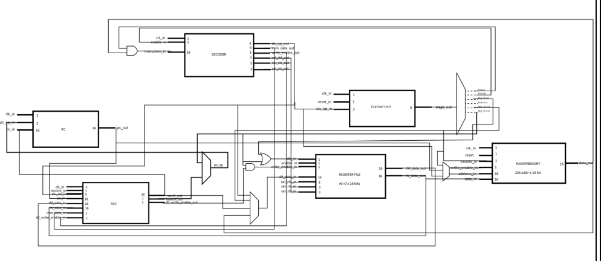

*Complete system architecture showing the interconnection of all processor components including CPU, ALU, Memory, Register File, Program Counter, and Control Unit.*

### Component Architecture Details

#### Arithmetic Logic Unit (ALU)
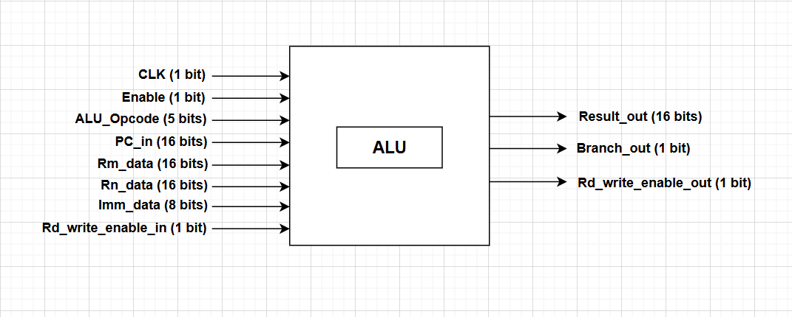

*Detailed ALU architecture showing input/output ports, operation codes, and internal logic for arithmetic and logical operations.*

#### Register File
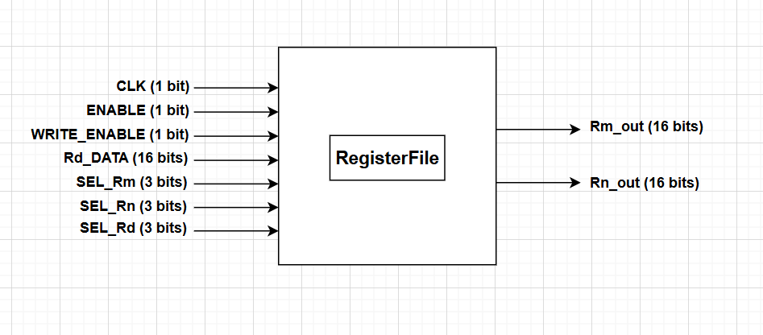

*Register file architecture displaying the 8 general-purpose 16-bit registers with read/write control logic and address decoding.*

#### Program Counter (PC)
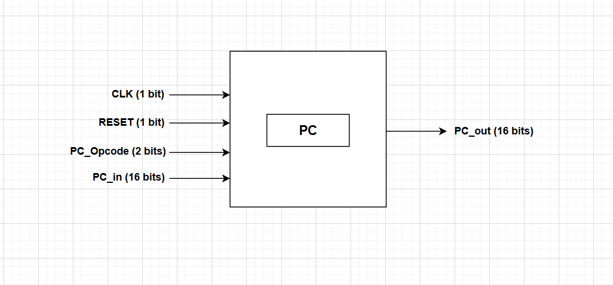

*Program counter module showing increment, branch, and reset functionality for instruction address management.*

#### Memory Module
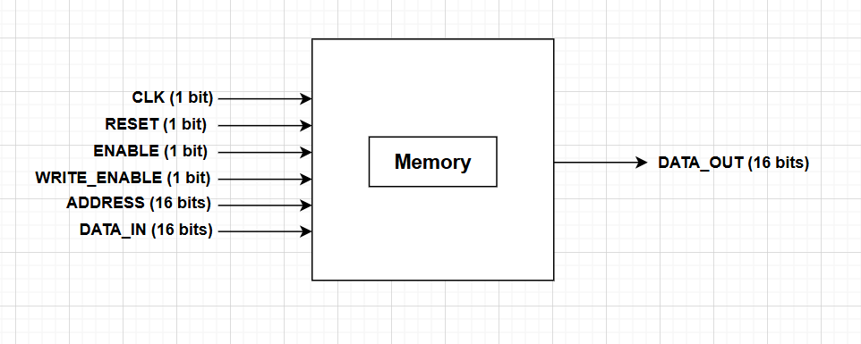

*Memory architecture illustrating data storage, address decoding, and read/write control mechanisms for both instruction and data memory.*

#### CPU Integration
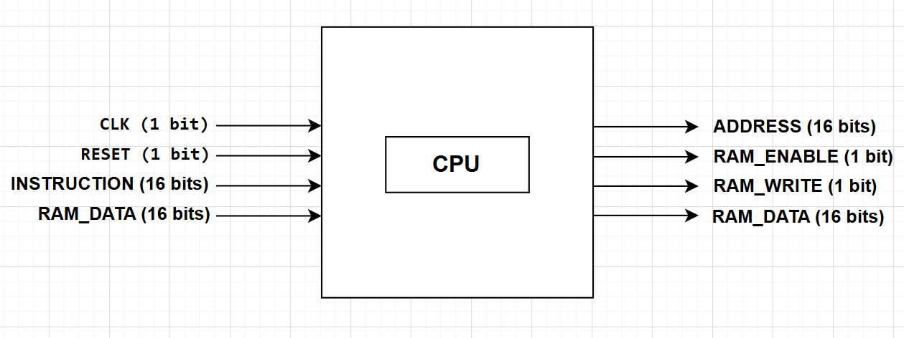

*Complete CPU architecture showing the integration of all components and the data flow between different modules.*

#### Control Unit
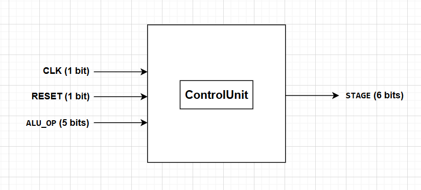

*Control unit architecture demonstrating instruction execution control, state management, and coordination of processor operations.*

#### Instruction Decoder
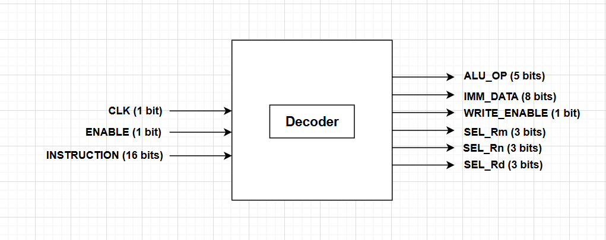

*Instruction decoder architecture showing how 16-bit instructions are decoded into control signals for different processor components.*

## 📋 Instruction Set Architecture (ISA)

### Instruction Categories

#### 1. Arithmetic and Logic Instructions
- **ADD**: Addition operation between registers
- **SUB**: Subtraction operation between registers  
- **AND**: Bitwise AND operation
- **OR**: Bitwise OR operation
- **XOR**: Bitwise XOR operation
- **NOT**: Bitwise NOT operation
- **LSL**: Logical Shift Left
- **LSR**: Logical Shift Right
- **CMP**: Compare two values

#### 2. Control and Branch Instructions
- **B**: Unconditional branch
- **BEQ**: Branch if equal
- **BNE**: Branch if not equal

#### 3. Memory Instructions
- **LDR**: Load data from memory to register
- **STR**: Store data from register to memory

#### 4. Immediate Instructions
- **IMM**: Load immediate value into register

### Instruction Formats

| Format | Bits 15-12 | Bits 11-8 | Bits 7-4 | Bits 3-0 | Description |
|--------|------------|-----------|----------|----------|-------------|
| **RRR** | OPCODE | rD | rM | rN | Three register operation |
| **RRU** | OPCODE | rD | rM | Unused | Two register operation |
| **RRI(5)** | OPCODE | rD | rM | IMM(5) | Register + 5-bit immediate |
| **RI(8)** | OPCODE | rD | IMM(8) | Register + 8-bit immediate |
| **UI(8)** | OPCODE | Unused | IMM(8) | 8-bit immediate operation |

## 📋 Instruction Set Details

### Complete Instruction Set
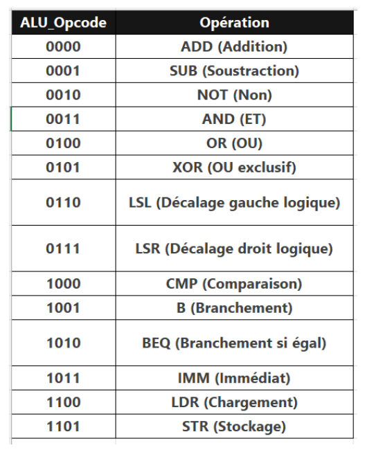

*Comprehensive instruction set table showing all supported operations, their opcodes, formats, and implementation details.*

### Instruction Format Specifications
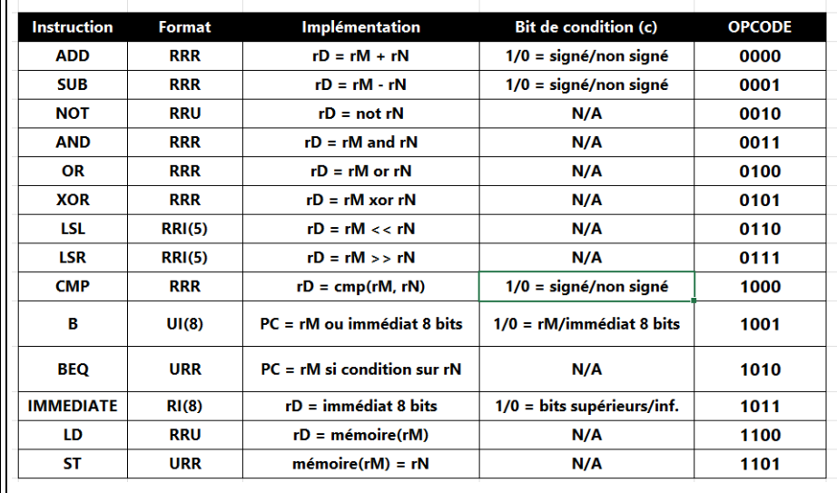

*Detailed instruction format specifications showing bit allocation for different instruction types (RRR, RRU, RRI, RI, UI).*

## 🛠️ Implementation Details

### VHDL Modules

#### 1. Arithmetic Logic Unit (ALU)
```vhdl
entity ALU is
    Port (
        CLK : in STD_LOGIC;
        Enable : in STD_LOGIC;
        ALU_Opcode : in STD_LOGIC_VECTOR(4 downto 0);
        PC_in : in STD_LOGIC_VECTOR(15 downto 0);
        Rm_data : in STD_LOGIC_VECTOR(15 downto 0);
        Rn_data : in STD_LOGIC_VECTOR(15 downto 0);
        Imm_data : in STD_LOGIC_VECTOR(7 downto 0);
        Rd_write_enable_in : in STD_LOGIC;
        Result_out : out STD_LOGIC_VECTOR(15 downto 0);
        Branch_out : out STD_LOGIC;
        Rd_write_enable_out : out STD_LOGIC
    );
end ALU;
```

#### 2. Instruction Decoder
```vhdl
entity Decoder is
    Port (
        INSTRUCTION : in STD_LOGIC_VECTOR(15 downto 0);
        CLK : in STD_LOGIC;
        ENABLE : in STD_LOGIC;
        ALU_OP : out STD_LOGIC_VECTOR(4 downto 0);
        SEL_Rm : out STD_LOGIC_VECTOR(2 downto 0);
        SEL_Rn : out STD_LOGIC_VECTOR(2 downto 0);
        SEL_Rd : out STD_LOGIC_VECTOR(2 downto 0);
        IMM_DATA : out STD_LOGIC_VECTOR(7 downto 0);
        WRITE_ENABLE : out STD_LOGIC
    );
end Decoder;
```

#### 3. Register File
```vhdl
entity RegisterFile is
    Port (
        SEL_Rm : in STD_LOGIC_VECTOR(2 downto 0);
        SEL_Rn : in STD_LOGIC_VECTOR(2 downto 0);
        SEL_Rd : in STD_LOGIC_VECTOR(2 downto 0);
        Rd_DATA : in STD_LOGIC_VECTOR(15 downto 0);
        WRITE_ENABLE : in STD_LOGIC;
        CLK : in STD_LOGIC;
        ENABLE : in STD_LOGIC;
        Rm_out : out STD_LOGIC_VECTOR(15 downto 0);
        Rn_out : out STD_LOGIC_VECTOR(15 downto 0)
    );
end RegisterFile;
```

## 🚀 Installation & Setup

### Prerequisites

```bash
# Required Software
- ModelSim (for simulation)
- Quartus Prime (for synthesis)
- VHDL compiler
- Text editor or VHDL IDE
```

### Project Setup

1. **Clone the repository**
   ```bash
   git clone https://github.com/yourusername/16bit-risc-processor-vhdl.git
   cd 16bit-risc-processor-vhdl
   ```

2. **Open in ModelSim**
   ```bash
   # Start ModelSim
   vsim
   
   # Compile VHDL files
   vcom *.vhdl
   
   # Load testbench
   vsim testbench_cpu
   ```

3. **Run Simulation**
   ```bash
   # Add signals to waveform
   add wave -r /*
   
   # Run simulation
   run -all
   ```

## 🧪 Testing and Validation

### Test Programs

#### Program 1: Addition Operation
```assembly
LOAD A, #1        ; Load value 1 into register A
LOAD B, #2        ; Load value 2 into register B  
ADD C, A, B       ; Add A and B, store result in C
STORE C, [3]      ; Store result at memory address 3
```

**Expected Result**: Memory address 3 contains value 3 (0x0003)

#### Program 2: Logical AND Operation
```assembly
LOAD X, #4        ; Load value 4 into register X
LOAD Y, #5        ; Load value 5 into register Y
AND Z, X, Y       ; Perform X AND Y, store in Z
STORE Z, [6]      ; Store result at memory address 6
```

**Expected Result**: Memory address 6 contains value 4 (0x0004)

### Simulation Results

#### Component Testing
- ✅ **ALU**: All arithmetic and logic operations verified
- ✅ **Decoder**: Instruction decoding validated for all formats
- ✅ **Register File**: Read/write operations confirmed
- ✅ **Program Counter**: Increment and branch operations tested
- ✅ **Memory**: Load/store operations validated
- ✅ **CPU Integration**: Complete processor functionality verified

#### Performance Metrics
- **Clock Frequency**: Up to 50 MHz (simulation)
- **Instruction Execution**: Single cycle for most operations
- **Memory Access**: Single cycle read/write
- **Register Access**: Zero wait state
- **Pipeline Depth**: Single stage (non-pipelined)

## 🧪 Simulation Examples

### ALU Testbench Example
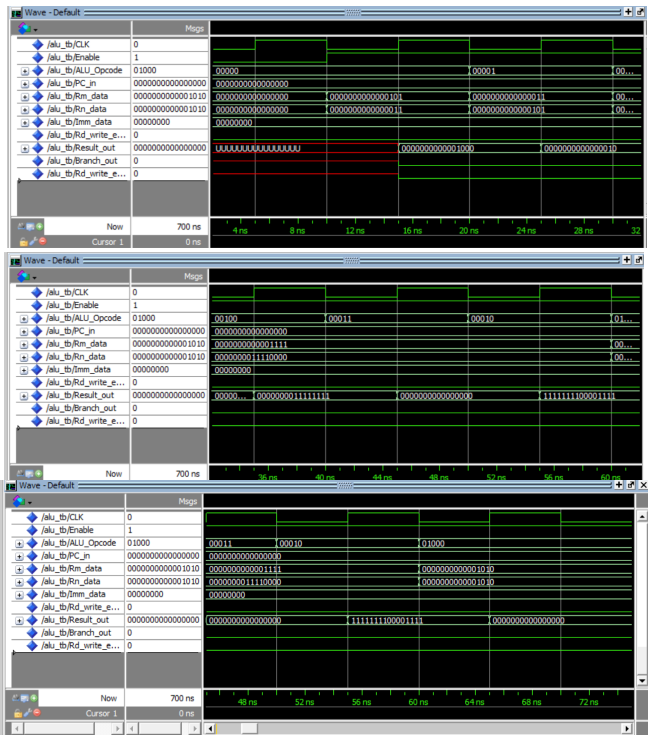

*Example ALU testbench simulation showing waveforms for various arithmetic and logical operations with timing analysis.*

## 📊 Results and Analysis

### Successful Features
- ✅ Complete 16-bit RISC processor implementation
- ✅ Custom instruction set with 15+ instructions
- ✅ Modular architecture with independent components
- ✅ Successful simulation of complex programs
- ✅ Proper instruction decoding and execution
- ✅ Functional memory and register operations

### Limitations and Challenges
- ⚠️ Limited to simulation environment (no hardware implementation)
- ⚠️ Single-cycle execution (no pipelining)
- ⚠️ Basic memory management (no cache)
- ⚠️ Limited debugging capabilities
- ⚠️ Time constraints affected advanced feature implementation

## 🚀 Future Enhancements

### Immediate Improvements
- **32-bit Architecture**: Expand to 32-bit data path for enhanced performance
- **Pipeline Implementation**: Add instruction pipelining for better throughput
- **Cache Memory**: Implement instruction and data caches
- **Interrupt Handling**: Add interrupt processing capabilities
- **Hardware Implementation**: Synthesize design for FPGA deployment

### Advanced Features
- **Branch Prediction**: Implement branch prediction mechanisms
- **Floating Point Unit**: Add floating-point arithmetic support
- **Memory Management**: Implement virtual memory and protection
- **Multi-core Design**: Extend to multi-core architecture
- **Debug Interface**: Add JTAG debugging support

## 🔧 Design Methodology

### Development Process
1. **Requirements Analysis**: Define processor specifications and constraints
2. **Modular Design**: Divide processor into functional components
3. **VHDL Implementation**: Code each module using structured VHDL
4. **Unit Testing**: Validate each component individually
5. **Integration**: Combine modules into complete processor
6. **System Testing**: Verify complete processor functionality

### Validation Strategy
- **Component-level Testing**: Individual module testbenches
- **Integration Testing**: Combined module functionality
- **Program Execution**: Real program simulation
- **Timing Analysis**: Clock and timing verification
- **Coverage Analysis**: Instruction set coverage validation

## 🤝 Contributing

Contributions are welcome! Please follow these guidelines:

1. Fork the repository
2. Create a feature branch (`git checkout -b feature/AmazingFeature`)
3. Commit your changes (`git commit -m 'Add some AmazingFeature'`)
4. Push to the branch (`git push origin feature/AmazingFeature`)
5. Open a Pull Request

### Development Guidelines
- Follow VHDL coding standards and best practices
- Include comprehensive testbenches for new features
- Document all modules with clear comments
- Test thoroughly in simulation before submitting
- Update documentation for any architectural changes

## 👥 Team

**Development Team:**
- **BOUARFA LAHMAR** - Project Lead & Architecture Design
- **Mohamed BOUFARHA** - VHDL Implementation & Testing

**Academic Supervision:**
- **Pr. AMMOUR Alae** - Module Supervisor

**Institution:** Euro-Mediterranean University of Fez (EuroMed)  
**School:** Digital Engineering and Artificial Intelligence (EIDIA)  
**Program:** Robotics & Cobotics Engineering

## 📚 Documentation

For detailed technical documentation and analysis (in French), please refer to:

**[📋 Click here to see project report (French version)](link-to-your-french-report)**

## 📞 Support & Contact

For all information, questions, help, or collaboration opportunities, feel free to contact me.
### Additional Support
- Open an issue on GitHub for technical problems
- Check the documentation in `/docs` for detailed information
- Contact the academic supervisor for academic-related inquiries
- Refer to VHDL simulation guides for ModelSim usage

I'm always happy to discuss this project, answer questions about VHDL implementation, processor design, or collaborate on similar digital design projects!


⭐ **If you found this project helpful, please give it a star!** ⭐

## 🏷️ Tags

`vhdl` `risc-processor` `16-bit-architecture` `digital-design` `processor-design` `instruction-set-architecture` `modelsim` `fpga` `computer-architecture` `embedded-systems` `hardware-description-language`
```
